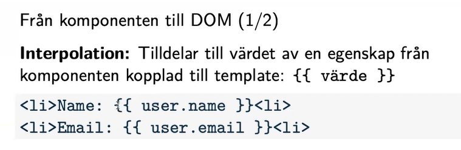
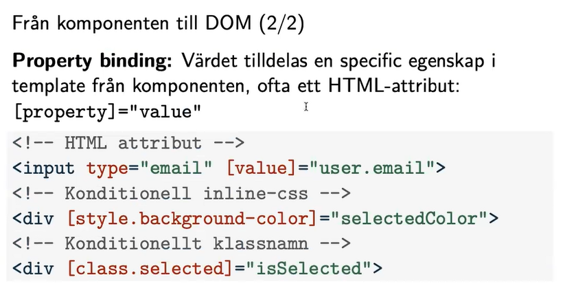

# The breakdown of Angular framework

Angular CLI is a powerful tool that facilitates the creation and management of Angular projects.

## Templates 

Templates in Angular define the user interface of the application using HTML with specific syntax to bind data from the code. In Angular, these templates are where you define the structure of your UI components and how they interact with data.

## Components 

Components are the building blocks of an Angular application. Each component sum up a portion of the UI and its logic. Components consist of a TypeScript class that defines the components behavior and properties, along with an HTML template that defines its view.

### Create a component 

Use command: 

```bash
ng generate component pages/home 

eller:

n g c pages/prodcut 

```

NOTE!!! Pages is like resoruces in Laravel. 

 
## Services 

Services are reusable pieces of code that provide functionality across an Angular application. They are used to encapsulate logic that doesn't belong in a specific component, such as data manipulation, HTTP requests, or other business logic. Services are typically singleton objects that can be injected into components, directives, or other services.

## Modules 

Modules in Angular are containers for organizing the application into cohesive blocks of functionality. They help in organizing the application into smaller, manageable pieces. Angular applications are built by composing modules together. Angular modules can include components, directives, pipes, and services, as well as other modules, and help in managing dependencies and providing a clear structure to the application.

Modules doenst exist in the latest v17 in Angular. 

@NgModule

----------------------

## Decorator pattern 


## comands 

Serve and open in broswer: 

```bash
ng serve -o 

```

## Data binding 

Interpolation 1/2 : 



Propterty binding 2/2: 



